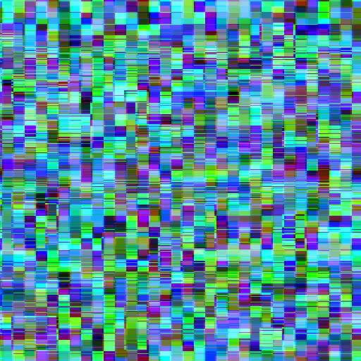

## Glitch NFT (Foundry)

Minimal ERC-721 collection with:
- Public minting (anyone can mint)
- Fixed max supply: 16 tokens (IDs 0..15)
- Enumerable (ERC721Enumerable)
- Metadata via base URI set in constructor

### Deployed (Sepolia)
- Contract: [0x5f64ff0979734ddbe59882374082a52537d2342b](https://sepolia.etherscan.io/address/0x5f64ff0979734ddbe59882374082a52537d2342b)

## Minting
Mint is public and enforces a hard cap of 16 tokens.

### Images
All 16 collection images (0..15):

| 0 | 1 | 2 | 3 |
|---|---|---|---|
|  |  |  |  |
| 4 | 5 | 6 | 7 |
|  |  |  |  |
| 8 | 9 | 10 | 11 |
|  |  |  |  |
| 12 | 13 | 14 | 15 |
|  |  |  |  |

## Metadata / IPFS
This contract uses a base metadata URI set in the constructor. `tokenURI(tokenId)` returns `string.concat(baseURI, tokenId)`.

Upload images directory to IPFS (recursively):
```bash
cd content/images
ipfs add -r .
```

Upload metadata directory to IPFS (recursively):
```bash
cd ../metadata
ipfs add -r .
```

Use the resulting CID as the constructor `baseMetadataURI`. Can be changed in `script/DeployGlitchNft.s.sol` before deploying.

## Notes
- Max supply is enforced on-chain (IDs 0..15).
- There is no owner; mint is public.
- Base metadata URI is immutable after deployment.